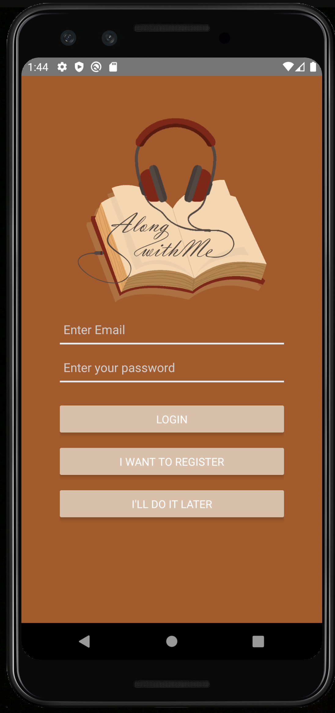

# Along With Me

## Description
Read along with me! Listen along with me! Adventure along with me! This audiobook companion app takes the text of your audiobook and 'listens' for specific words for background noise. Really transport yourself! When our application registers the word 'fire' hear a crackling fireplace. Set the specific sounds you want to hear and the volume in the settings.

## Table of Contents
* [Installation](#installation)
* [Usage](#usage)
* [License](#license)
* [Contributing](#contributing)
* [Links](#Links)
* [Tenchnologies](#Technologies)
* [Icebox](#Icebox)
* [Developers](#Developers)

## Installation
npm i

## Usage
This application is run with React-Native. To run this application locally with android, an android emulator with AndroidStudio needs to be installed. To run with ios, xcode must be installed.

Updates need to be made to react-native-highlight-words node module to update run this package as well;

In react-native-highlight-words index.js, copy and paste this code:

     import React from 'react';
     import {Text} from 'react-native';
     import {findAll} from 'highlight-words-core';
     import PropTypes from 'prop-types';

     Highlighter.propTypes = {
          autoEscape: PropTypes.bool,
          highlightStyle: Text.propTypes.style,
          searchWords: PropTypes.arrayOf(PropTypes.string).isRequired,
          textToHighlight: PropTypes.string.isRequired,
          sanitize: PropTypes.func,
          style: Text.propTypes.style,
          onPressNormalText: PropTypes.func,
          onPressHighlightedText: PropTypes.func
     };

     export default function Highlighter({
          autoEscape,
          highlightStyle,
          searchWords,
          textToHighlight,
          sanitize,
          style,
          onPressNormalText,
          onPressHighlightedText,
          ...props
     }) {
          const chunks = findAll({textToHighlight, searchWords, sanitize, autoEscape});

    return (
        <Text style={style} {...props} onPress={onPressNormalText}>
            {chunks.map((chunk, index) => {
                const text = textToHighlight.substr(chunk.start, chunk.end - chunk.start);

                return (!chunk.highlight)
                    ? text
                    : (
                        <Text
                            key={index}
                            onPress={onPressHighlightedText}
                            style={chunk.highlight && highlightStyle}
                        >
                            {text}
                        </Text>
                    );
            })}
        </Text> 
      );
     }

Also to run this application, some lines must be commented out in Android/app/src/main/java/MainApplication.java:
* lines 37 - 41

You run this application in terminal or bash with npx react-native start. To start the android application run npx react-native run-android.
To start the ios application run npx react-native run-ios

## License
MIT

## Contributing
Contributors allowed, please reach out to admin if interested.

## Links
* GitHub repository URL: https://github.com/eh4git/Along-With-Me

## Technologies

### Languages 
* React-Native (Javascript), CSS

### FrameWorks
* Bootstrap, Express

### Dependencies

* react-native-sound
* react-native-voice

## Icebox

* Ability to listen and then play the sound - voice to audio, not just text to audio

## Developers

### Anna Conover
<!-- 

* Github username: annaxgrace
* Email: anna.grace.conover@gmail.com
* GitHub Profile URL: https://github.com/AnnaxGrace

### Vinne Lopez

<!--  -->

* Github username: vinnielo
* Email: vinnielo01@gmail.com
* GitHub Profile URL: https://github.com/vinnielo

### Julia "Jace" Clements

<!--  -->

* Github username: tiiedye
* Email: tiiedye@gmail.com
* GitHub Profile URL: https://github.com/tiiedye

### Erik Hirsch

<!--  -->

* Github username: eh4git
* Email: ehirsch760@gmail.com
* GitHub Profile URL: https://github.com/eh4git

## Credits to ZapSplat for sounds

